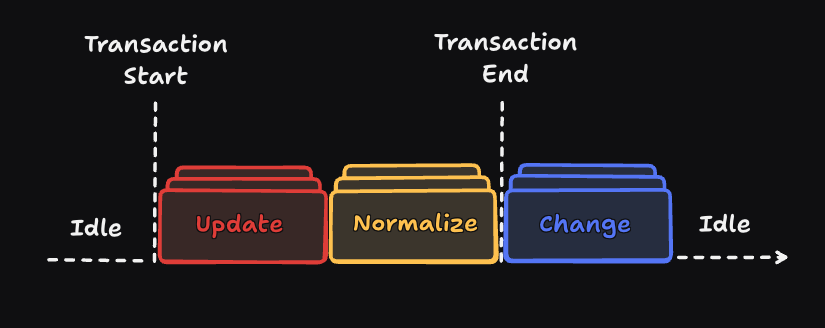

## The 4 stages



A `Doc` goes through four main stages: `idle`, `update`, `normalize`, and `change`.
Understanding these stages is key because mutating the document outside of allowed contexts, like in a change event, will throw a runtime error.

Let's look at the characteristics of each stage:

### 1. Idle

- The document is not undergoing any transaction.
- No changes are being applied.

### 2. Update

- Any method that mutates the document begins a transaction.
- All mutations that occur in the same microtask are automatically batched (see [batching below ↓](#batching)).
- The transaction is aborted if an error is thrown, or if `doc.abort()` is called.

### 3. Normalize

- Triggered automatically within a transaction before the final `change` event.
- Purpose: fix, enforce structure, or apply consistent transformations to the document.
- Callbacks can mutate the document, but must be pure: they should correct the doc in a single pass and not depend on side effects.
- In strict mode{/* (TODO:  (Development environment)) */}:
  - Normalizer callbacks are executed twice.
  - If the callback mutates the document on the second pass, an error is thrown.
  - This ensures normalization logic is idempotent and safe.
- Normalizer callbacks can optionally abort the transaction by throwing an error or using `doc.abort()`.

### 4. Change

- Runs at the end of a transaction, after all updates and normalizations have been applied.
- This is the stage where external systems or listeners should respond to committed changes (e.g., syncing with a server or updating UI).
- Read-only operations are safe here.
- Attempting to mutate the document in this stage will throw a runtime error.
- At the end of the change stage, [`operations`, `inverseOperations` and `diff`](/docs/operations-and-diff) are cleared.

---

### Summary Table

| Stage     | Can mutate? | Can abort transaction? | Runs twice in strict mode? |
| --------- | ----------- | ---------------------- | -------------------------- |
| Idle      | N/A         | N/A                    | N/A                        |
| Update    | Yes         | Yes                    | No                         |
| Normalize | Yes\*       | Yes                    | Yes                        |
| Change    | No          | No                     | No                         |

\*Normalize can only mutate the document on the first pass.

## Batching

How many times do you think the following code will log "changed"?

```ts
const ExampleNode = defineNode({
  type: "example",
  state: {
    value: string(""),
  },
});
const doc = new Doc({ extensions: [{ nodes: [ExampleNode] }] });

doc.onChange(() => {
  console.log("changed"); // HOW MANY TIMES WILL THIS BE CALLED?
});

const exampleNode = doc.createNode(ExampleNode);
doc.root.append(exampleNode);
exampleNode.state.value.set("hello ");
exampleNode.state.value.set((current) => current + "world");
const exampleNode2 = doc.createNode(ExampleNode);
exampleNode.insertAfter(exampleNode2);
exampleNode2.state.value.set("A new node!");
```

The answer is only one! Even though there are 5 mutation operations (3 state updates, 1 append, and 1 insertAfter), they are all automatically batched into a single transaction. This is similar to what almost all modern frontend frameworks like React do.

In libraries similar to DocNode you often need to wrap mutations in explicit transaction callbacks, such as `editor.update` in Lexical or `ydoc.transact` in Yjs, to batch changes. Without those wrappers, you would either get runtime errors or trigger multiple event listeners. DocNode handles automatic batching without requiring a wrapper function to improve DX and performance.

Transactions in DocNode are atomic, just like in databases. This means that if an error is thrown in the middle of a transaction, all changes made up to that point are rolled back automatically.

Another novel aspect of DocNode is that, instead of storing a full copy of the document for rollback or undo management in every transaction, it only stores the inverse operations in a super-compact format.

Any code running in a different microtask will be part of a separate transaction. This includes:

- Code following an awaited promise in async functions, or inside a `then` callback.
- Mutations within `setTimeout`, `queueMicrotask`, `requestAnimationFrame`, or similar.

Finally, DocNode provides two ways to end a transaction synchronously:

- `doc.forceCommit()`: Ends the transaction immediately, triggering events.
- `doc.abort()`: Changes up to that point are reverted and therefore no events are fired.

{/* TODO: */}

## Register, Normalize, and Change

Extensions accept an optional `register` function that is called when the document is initialized.

```ts
import { type Extension } from "docnode";

const MyExtension: Extension = {
  register: (doc) => {
    console.log("document initialized");
  },
};
```

You cannot update the document in the register callback. Its purpose is to register events, primarily normalize events.

Unlike the change event, the normalize event must be registered within the `register` function of an extension, otherwise it will result in a runtime error:

```ts
import { type Extension } from "docnode";

const MyExtension: Extension = {
  register: (doc) => {
    // ✅ Allowed
    doc.onNormalize(({ diff }) => {
      console.log("normalize", diff);
    });
    // ✅ Allowed
    doc.onChange(({ diff }) => {
      console.log("change", diff);
    });
  },
};

const config = { extensions: [MyExtension] };
const doc = new Doc(config);

// ❌ Not allowed, need to be in a `register` callback
doc.onNormalize(({ diff }) => {
  console.log("normalize", diff);
});

// ✅ Allowed
doc.onChange(({ diff }) => {
  console.log("change", diff);
});
```

This is done this way for two reasons:

1. Normalizers can be considered the document's "parser". Since they are included in the extensions, you could simply copy your document's configuration to your server to ensure that your conditions are enforced on the server as well.
2. Secondly, the `register` callbacks are executed only once, thus avoiding registering the same normalizer multiple times, a common error in React.

To summarize, here are the differences between the `change` event and the `normalize` event.

| Event       | Where can it be registered | Can be unregistered? | Callback runs                         |
| ----------- | -------------------------- | -------------------- | ------------------------------------- |
| onChange    | anywhere                   | Yes                  | Change stage (after transaction)      |
| onNormalize | in a `register` callback   | No                   | Normalize stage (before change stage) |

`register` is usually a good place to register your change events as well, but if for some reason you need to register it in a place that runs multiple times, such as a DOM event or in a React component, you must remember to unregister it.

```ts
// Example 1
const offChange = doc.onChange(() => {
  /* ... */
});
offChange();

// Example 2 (React Component)
const MyComponent = () => {
  useEffect(() => {
    // You must return the unregister function to avoid memory leaks
    return doc.onChange(() => {
      /* ... */
    });
  }, [doc]);
};
```

{/* TODO: explain parameters of onChange and onNormalize? */}

## When to serialize a document to JSON

You can safely call `doc.toJSON()` when the document is in the `idle` or `change` stages. In the `normalize` or `update` stages it will throw an error, because the document is in the middle of a transaction and its state may still change or be rolled back, so the resulting JSON is not suitable for storing or syncing.

If you really need to inspect the document at that moment, you can bypass the restriction with `doc.toJSON({ unsafe: true })`. That property is intended only for debugging, not for storing data.
